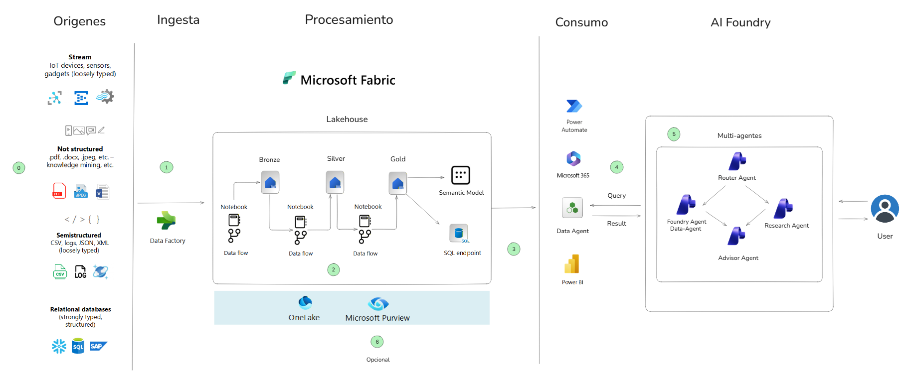
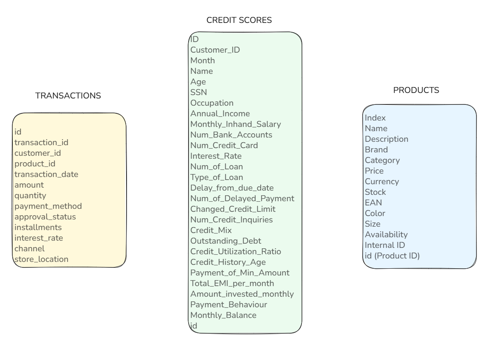

 
  
  &nbsp;&nbsp;&nbsp;
  

# 🧠 AI Fabric Hackathon  

## 🎯 Objetivos del Hackathon

Al finalizar este hackathon, los participantes serán capaces de:

- Preparar, transformar y enriquecer datos financieros, retail y transaccionales usando **Microsoft Fabric**, aplicando el modelo **medallion** para estructurar capas de valor analítico.  
- Ingestar datos desde sistemas core, fuentes externas y APIs mediante **pipelines, notebooks y conectores nativos de Fabric**.  
- Diseñar **modelos semánticos** robustos que faciliten el consumo de datos por analistas, auditores y sistemas de inteligencia.  
- Monitorear y optimizar el consumo de capacidad en **Fabric**, aplicando métricas clave para gobernanza operativa y eficiencia de recursos.  
- Construir **agentes de inteligencia artificial** con **AI Foundry** para análisis predictivo, detección de fraude y generación de insights financieros.  
- Orquestar flujos multi-agente y procesos de datos, habilitando automatización inteligente en escenarios bancarios y de seguros.
- Visualizar **insights estratégicos** con **Power BI en Microsoft Fabric**, habilitando tableros interactivos para decisiones basadas en datos.
  
**Bonus**
- Aplicar **controles de seguridad y gobernanza** de datos sensibles, configurando roles, permisos y políticas en workspaces de Fabric.   
- Integrar **Microsoft Purview** para trazabilidad, clasificación y cumplimiento normativo, fortaleciendo la gobernanza de datos en entornos regulados.  

# Agenda

| Día  | Actividad                                                                 | Tipo   |
|------|---------------------------------------------------------------------------|--------|
| Día 1 | Preparación de datos (estructuración, limpieza, perfilado)               | Reto   |
| Día 1 | Ingesta de datos desde fuentes internas y externas                      | Reto   |
| Día 1 | Transformación de datos con notebooks y pipelines                        | Reto   |
| Día 1 | Enriquecimiento de datos y creación de modelo semántico                  | Reto   |
| Día 1 | Round Table: Q&A con expertos y participantes                            | Reto   |
| Día 1 | Cierre y resumen del día                                                 | Cierre |
| Día 2 | Construcción de agente AI Foundry para análisis predictivo               | Reto   |
| Día 2 | Orquestación multi-agente con pipelines y triggers                       | Reto   |
| Día 2 | Seguridad en Fabric: roles, objetos, workspaces (opcional)               | Reto   |
| Día 2 | Sesión de valor: Q&A sobre adopción, impacto y próximos pasos            | Cierre |
| Día 2 | Cierre y entrega de reconocimientos                                      | Cierre |

# Arquitectura

# 📖 Historia de Caso de Uso
 
## "Contoso y la Inteligencia de Datos Multisectorial en Acción"
 
**Contoso**, una organización con presencia en los sectores **financiero y comercial**, enfrenta el reto de consolidar información proveniente de múltiples fuentes para habilitar análisis confiables, automatización inteligente y experiencias conversacionales basadas en datos. En el marco de este hackathon, los participantes asumen el rol de **equipo técnico** encargado de construir una solución moderna sobre **Microsoft Fabric**, poniendo a prueba sus habilidades en un entorno realista y multisectorial.
 
### 🗃️ Fuentes de Datos
El escenario comienza con tres conjuntos de datos en formato **JSON**, ingestados desde una base de datos NoSQL **Cosmos DB**:
 
• **Set de score crediticio:** información de clientes, comportamiento de pago y perfil financiero

• **Set de productos retail:** datos sobre disponibilidad, valor comercial, categoría y marca de productos retail

• **Set de transacciones:** compras de clientes, canales de compra, tasas de interes, locacion 

 
### 🎯 Objetivo Principal
Transformar, limpiar y estructurar los datasets en un **modelo enriquecido** que sirva como base para la creación de **agentes de inteligencia artificial**. Para ello, los participantes aplicarán el **modelo medallion** (Bronze → Silver → Gold), asegurando la calidad, trazabilidad y valor analítico de la información. El enfoque del ejercicio es por objetivos, por lo cual no hay una unica solucion y se motiva a que utilizen diferentes enfoques para completarlo.
 
### 📊 Modelo Semántico y Métricas Clave
Una vez estructurados los datos en la **capa Gold**, se diseñará un **modelo semántico en Power BI**, que permitirá correlacionar métricas clave como por ejemplo:
 
• Score promedio por segmento  
• Valor comercial por categoría  
• Tasa de devolución por marca  
• Tendencias mensuales de riesgo o ventas  
• Performance por canal  
• Analisis de MSI (Meses sin Intereses)  
• Metodos de pago  

 
### 🤖 Agentes Conversacionales
Utilizando **AI Foundry**, los participantes crearán **agentes** capaces de interactuar con los datos mediante **lenguaje natural**, sin mostrar código técnico, resolviendo desafíos de automatización y orquestando flujos multi-agente con **modelos de lenguaje de gran escala (LLMs)**. Estos agentes estarán conectados a los modelos semánticos mediante **Data Agents**, permitiendo consultas conversacionales como:
 
• *"¿Qué segmento tiene mayor score promedio?"*  
• *"¿Qué productos tienen mayor tasa de devolución?"*  
• *"¿Hay relación entre score y monto de compra?"*  
• *¿Cómo compran los clientes según su perfil crediticio?"*  
• *"¿Qué categorías de productos prefiere cada perfil crediticio?"*  
 
### 📈 Visualización e Insights
Finalmente, los **insights generados** se visualizarán en **tableros interactivos en Power BI**, facilitando la toma de decisiones basada en datos tanto para **analistas financieros** como **comerciales**. Este caso ejemplifica una adopción realista y escalable de **Microsoft Fabric** en entornos híbridos, donde la **inteligencia de datos** se convierte en una ventaja competitiva para Contoso, impulsando la innovación, la eficiencia operativa y la democratización del análisis.
 
---
 
# 🎯 Resumen de Retos - Del Insight a la Decisión
 
## 🏆 Reto 00: Configuración de Zona de Aterrizaje y Preparación de Datos
 
**📖 Escenario:** Contoso debe preparar el entorno de trabajo en Microsoft Fabric, conectando datos almacenados en Azure Cosmos DB y estableciendo una zona de aterrizaje estructurada en capas.
 
### 🎯 Objetivos Clave:
- ✅ Crear Azure Cosmos DB NoSQL y cargar datasets JSON (financiero, retail, transacciones)
- ✅ Configurar workspace en Microsoft Fabric con estructura de capas
- ✅ Establecer conexión entre Cosmos DB y Fabric
- ✅ Crear Lakehouse con arquitectura medallion (Bronze, Silver, Gold)
- ✅ Explorar y validar estructura de datos JSON
 
### 🚀 Entregables:
- Cosmos DB configurado con contenedores de datos
- Workspace de Fabric con Lakehouse estructurado por capas
- Documentación del flujo de datos planificado
 
---
 
## 🏆 Reto 01: Ingesta de Datos desde Cosmos DB a Microsoft Fabric (Capa Bronze)
 
**📖 Escenario:** Consolidar datos operativos de Contoso en Microsoft Fabric mediante ingesta desde Azure Cosmos DB hacia la capa Bronze, aplicando limpieza básica.
 
### 🎯 Objetivos Clave:
- ✅ Implementar ingesta con Dataflows Gen2 desde Cosmos DB
- ✅ Aplicar limpieza básica (valores nulos, columnas innecesarias, normalización)
- ✅ Validar carga y estructura de datos en capa Bronze
- ✅ Preparar datos para transformaciones avanzadas
 
### 🚀 Entregables:
- Dataflow Gen2 funcional con transformaciones básicas
- Tabla Bronze con datos limpios y estructurados
- Validación de integridad de datos ingeridos
 
---
 
## 🏆 Reto 02: Transformación Intermedia y Análisis Exploratorio (Capa Silver)
 
**📖 Escenario:** Evaluar calidad de datos y crear versión intermedia optimizada en capa Silver, aplicando transformaciones avanzadas y análisis exploratorio con Machine Learning.
 
### 🎯 Objetivos Clave:
- ✅ Crear tablas Silver con transformaciones intermedias
- ✅ Aplicar agrupaciones y métricas analíticas (score crediticio por cliente, perfiles de producto, transacciones por canal)
- ✅ Implementar análisis exploratorio con K-Means clustering u otro modelado de preferencia (puede ser analisis no predictivo si no se maneja ML)
- ✅ Preparar datos para modelado semántico en Gold
 
### 🚀 Entregables:
- Tablas Silver con transformaciones, predicciones y métricas de negocio
- Análisis de clustering con insights de segmentación (o analisis equivalente)
- Datos optimizados listos para capa Gold
 
---
 
## 🏆 Reto 03: Modelo Semántico, Data Agent y Dashboard de Valor (Capa Gold)
 
**📖 Escenario:** Habilitar análisis de negocio mediante modelo semántico robusto, Data Agent conversacional y dashboard interactivo para responder preguntas clave del negocio.
 
### 🎯 Objetivos Clave:
- ✅ Diseñar modelo semántico Gold con medidas y relaciones relevantes. Se pueden implementar modelos normalizados o denormalizados.
- ✅ Crear Data Agent conectado al modelo semántico o a las tablas Gold del Lakehouse
- ✅ Desarrollar dashboard Power BI con visualizaciones de valor
- ✅ Validar respuestas a preguntas de negocio mediante Copilot
 
### 🚀 Entregables:
- Modelo semántico con medidas clave (ejemplo: valor_comercial_total, productos_disponibles)
- Data Agent funcional para consultas en lenguaje natural
- Dashboard Power BI publicado con métricas estratégicas
 
---
 
## 🏆 Reto 04: Creación de Agente Conversacional en AI Foundry
 
**📖 Escenario:** Permitir que analistas interactúen con datos usando lenguaje natural, creando un agente en Azure AI Foundry integrado con el modelo semántico de Fabric.
 
### 🎯 Objetivos Clave:
- ✅ Diseñar agente conversacional en AI Foundry integrado con Fabric
- ✅ Conectar agente al Data Agent asociado al modelo semántico Gold
- ✅ Configurar intents y prompts orientados a preguntas reales de negocio
- ✅ Validar respuestas en lenguaje natural sin código técnico
- ✅ Publicar agente para uso de analistas
 
### 🚀 Entregables:
- Agente conversacional funcional en AI Foundry conectado a Data Agent de Fabric
- Configuración de intents para preguntas de negocio frecuentes
- Integración completa con modelo semántico de Fabric
- Validación de respuestas en lenguaje natural
 
---
 
## 🏆 Reto 05: Orquestación Multi-agente y Flujos Colaborativos
 
**📖 Escenario:** Diseñar y documentar un flujo multi-agente que coordine ingesta, análisis y ejecución para automatizar tareas complejas y adaptarse dinámicamente a escenarios cambiantes.
 
### 🎯 Objetivos Clave:
- ✅ Definir tres agentes especializados [Sales Analyst, Credit Analyst, Research Analyst] y uno sintetizador [Strategy Advisor]. Puedes definirlos segun el escenario que planteaste.
- ✅ Diseñar flujo orquestado
- ✅ Simular escenarios de negocio y validar el comportamiento de los agentes
- ✅ Documentar diseño para replicabilidad y escalabilidad
 
### 🚀 Entregables:
- Arquitectura de tres agentes con roles definidos y un agente sintetizador
- Flujo orquestado
- Simulación de escenarios de negocio
- Documentación completa del diseño multi-agente
 
---
 
## 📚 Recursos y Documentación
 
### 🔗 Enlaces de Referencia:
- [Documentación Microsoft Fabric](https://learn.microsoft.com/es-es/fabric/)
- [Azure AI Foundry](https://learn.microsoft.com/es-es/azure/ai-foundry/)
- [Power BI Embedded](https://learn.microsoft.com/es-es/power-bi/)
- [Azure Cosmos DB](https://learn.microsoft.com/es-es/azure/cosmos-db/)
 
### 🎯 Próximos Pasos:
Con estos retos completados, habrás construido una solución completa que va **del insight a la decisión**, implementando:
- ✅ Pipeline de datos completo con arquitectura medallion
- ✅ Modelo semántico robusto para análisis de negocio
- ✅ Agentes conversacionales para democratización de datos
- ✅ Orquestación inteligente y dinámica para automatización de procesos

